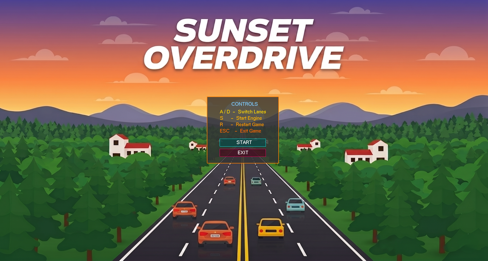
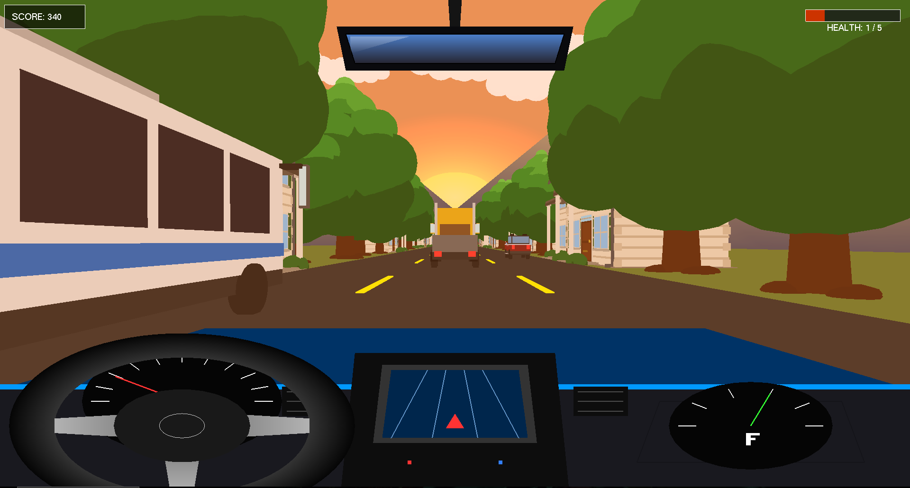
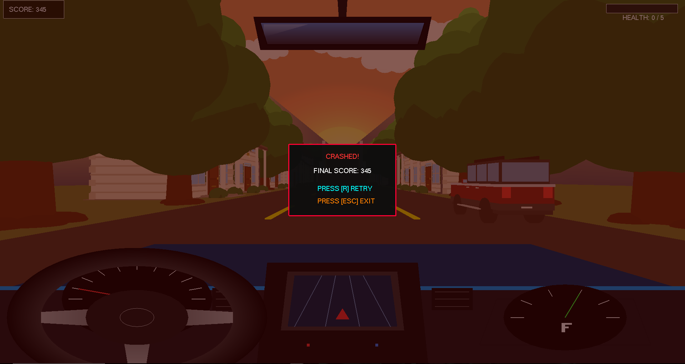

# 3D Car Driving Game 🚗


A 3D car driving game built using C, OpenGL, and GLUT featuring dynamic traffic, procedural scenery, collision detection, and custom 3D vehicle models.

## Features
- 3D highway driving system
- Multiple vehicle types (Car, Bus, Truck)
- Dynamic obstacle spawning
- Collision detection and health system
- Procedural trees and houses
- Animated clouds and sunset environment
- Custom 3D models created with OpenGL primitives
- HUD with score and health
- Smooth lane movement and steering

## Technologies Used
- C
- OpenGL
- GLUT
- GLU
- stb_image

## Controls

| Key | Action |
|------|--------|
| A / Left Arrow | Move Left |
| D / Right Arrow | Move Right |
| R | Restart |
| ESC | Exit Game |

## Running the Game

### Run Prebuilt Executable
Run:

```bash
Sunset Overdrive.exe
```

Required DLL files:
- libgcc_s_seh-1.dll
- libstdc++-6.dll
- libwinpthread-1.dll

These files are already included in the repository.

## Build From Source

Compile using MinGW:

```bash
gcc test.c -o game -lopengl32 -lglu32 -lfreeglut
```

Then run:

```bash
game.exe
```

## Project Structure

```text
.
├── test.c
├── stb_image.h
├── menu.png
├── Sunset Overdrive.exe
├── libgcc_s_seh-1.dll
├── libstdc++-6.dll
├── libwinpthread-1.dll
└── README.md
```

## Screenshots

### Main Menu


### Gameplay


### Crash Scene



## Notes
- Developed as a Computer Graphics/OpenGL project
- Uses custom geometry and rendering logic instead of external 3D engines
- Optimized for desktop systems with OpenGL support

## License
This project is licensed under the MIT License.
````
